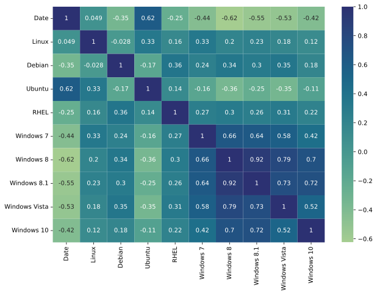

<h1>Linux Usage Trend and End of Lifetime of Windows Versions</h1>

<h2>Overview</h2>
With the discontinuation of Windows 10 support from Microsoft, the current users of Windows 10 (excluding LTSC and IoT versions) will not be able to receive support, including security updates. This raises concerns amongst users, primarily due to security. Some believe that there will be a noticeable shift towards linux systems, resulting in changes among OS market shares, while some believe that there won't be any noticeable shift. My research aims to come up with a satisfactory result that tries to give an answer to the given question, by analyzing the change in market shares of windows and linux after end of support periods of various windows versions, starting from Windows XP up until Windows 10.

<h2>Motivation</h2>
As a Linux user, hearing people stating that users are switching from windows to linux due to recent end of support decision from Microsoft is an interesting take, and since there is no such official statistic regarding this topic, I decided to conduct my own research using various datasets.

<h2>Methodology</h2>
Data from multiple resources will be used to understand if there's a significant shift of users from windows to linux. Initially, data will be collected, then preprocessed, and then statistical tests will be implemented based on the parameters of the datasets.

<h2>Hypotheses</h2>
<strong>H0 (Null Hypothesis)</strong>: The end of support for Windows operating system versions does not lead to a increase in Linux usage. 
<strong>H1 (Alternative Hypothesis)</strong>: The end of support for Windows operating system versions leads to a increase in Linux usage.  

<h2>Data Source</h2>
<strong>Desktop OS Market Shares (2009-2025)</strong>
<ul>
  <li><a href="https://gs.statcounter.com/os-market-share/desktop/worldwide">https://gs.statcounter.com/os-market-share/desktop/worldwide</a></li>
</ul> 
<strong>GitHub API</strong>
<ul>
  <li>Using the URL <a href="https://api.github.com/search/repositories">https://api.github.com/search/repositories</a> with help of scraper.py
</ul>
<strong>Wikimedia Pageviews API</strong>
<ul>
  <li><a href="https://pageviews.wmcloud.org/">https://pageviews.wmcloud.org/</a></li>
</ul>

<h2>Data Collection</h2>
<ol>
  <li> Data of OS Market Shares from 2009 to 2025 is collected from <a href="https://gs.statcounter.com/os-market-share/desktop/worldwide">https://gs.statcounter.com/os-market-share/desktop/worldwide</a>. Multiple csv files with varying categories are obtained, which are combined into a single .csv file (named <strong>2009_2025_combined_out.csv</strong>) using combine_marketshare_csv.py script.</li> 
  <li>For each day, number of pageviews for wikipedia pages named <strong>Linux</strong>, <strong>Debian</strong>, <strong>Ubuntu</strong>, <strong>Red Hat Enterprise Linux</strong>, <strong>Windows XP</strong>, <strong>Windows Vista</strong> <strong>Windows 7</strong>, <strong>Windows 8</strong>, <strong>Windows 8.1</strong>, <strong>Windows 10</strong> within the range July 2015 - November 2025 are obtained from <a href="https://pageviews.wmcloud.org/">https://pageviews.wmcloud.org/</a></li>
  <li>Number of stars, watchers, owner username and URL of top 100 repositories for each month starting from January 2015 to November 2025, that include keyword "linux" are fetched with help of Github API, using scraper.py script. <strong>(DISCLOSURE)</strong> Scraper script is written with help of Gemini.
  <li>Year, Month, Name, Star Count and Watcher Count data of github repositories that include keyword "linux" are fetched with help of github API using scraper.py script. <strong>Disclaimer</strong>: Gemini Pro (Generative AI tool) was used to write this script.
</ol>

<h2>Data Preprocessing</h2>
<ol>
  <li>Redundant columns (OS X, Nintendo, PlayStation and any column that isn't windows nor linux) from the OS market shares dataset are removed.</li>
  <li>Columns with only NULL values are removed from both OS market share dataset and wikipedia pagevisit counts dataset.</li>
  <li>Due to lack of data for the year 2014, data of Windows XP is removed from pageviews dataset.</li>
  <li>Data from github repositories is aggregated with respect to month-year combinations. That is, star count for the given MM-YYYY is aggregated with help of pandas. Log-transformation will be applied when necessary (i.e., when using a parametric test), since the data is highly skewed.
</ol>

<h2>Exploratory Data Analysis</h2>
<h3>Visual Analysis</h3>
<ul>
  <li>Windows market share declines gradually, despite rare increases in a few periods.</li>
  <li>Linux market share increases steadily, despite some declines in a few periods.</li>
  <li>A moderately linear, negative relationship is seen between Linux market share and Windows market share</li>
  <li>There is a spike in pageviews count of Windows Vista around the end of support date (April 11, 2017)</li>
  <li>There is a spike in pageviews count of Windows 7 around the end of support date (January 14, 2020)</li>
  <li>There is a spike in pageviews count of Windows 8.1 around the end of support date (January 10, 2023)</li>
  <li>There is a spike in pageviews count of Windows 10 around end of the support date (October 10, 2025)</li>
</ul>

<h3>Statistical Analysis</h3>
<ul>
  <li>The heatmap of pageviews is as follows:</li>
  
  <li>Mean of Windows market share throughout the years is found to be 83.144427%</li>
  <li>Mean of Linux market share throughout the years is found to be 1.704948%</li>
  <table>
    <tr>
        <th>Null Hypothesis</th>
        <th>Alternative Hypothesis</th>
        <th>Test Used</th>
        <th>Result</th>
    </tr>
    <tr>
      <td>End of support for windows 7 did not lead to an increase in pageview count of linux</td>
      <td>End of support for windows 7 lead to an increase in pageview count of linux</td>
      <td>Mann-Whitney U-test (One-tailed)</td>
      <td>p-value of 1 is obtained, fail to reject null hypothesis</td>
    </tr>
    <tr>
      <td>End of support for windows 8.1 did not lead to an increase in pageview count of linux</td>
      <td>End of support for windows 8.1 lead to an increase in pageview count of linux</td>
      <td>Mann-Whitney U-test (One-tailed)</td>
      <td>p-value of 1 is obtained, fail to reject null hypothesis</td>
    </tr>
    <tr>
      <td>End of support for windows 10 did not lead to an increase in pageview count of linux</td>
      <td>End of support for windows 10 lead to an increase in pageview count of linux</td>
      <td>Mann-Whitney U-test (One-tailed)</td>
      <td>p-value of 0.99 is obtained, fail to reject null hypothesis</td>
    </tr>
    <tr>
      <td>End of support for windows 8.1 did not lead to an increase in total star count of repositories that include keyword "linux"</td>
      <td>End of support for windows 8.1 lead to an increase in total star count of repositories that include keyword "linux"</td>
      <td>T-test (One-tailed)</td>
      <td>p-value of 1.77e-14 is obtained, reject null hypothesis</td>
    </tr>
  </table>
</ul>

<h4>The visuals and steps taken during whole EDA process can be seen via EDA.ipynb file.</h4>

<h3>Machine learning methods</h3>
<h4>Polynomial Regression</h4>
<table>
    <thead>
        <tr>
            <th>Y Value</th>
            <th>R-Squared Score</th>
            <th>RMSE</th>
        </tr>
    </thead>
    <tbody>
        <tr>
            <td>Linux market share</td>
            <td>0.9470</td>
            <td>0.2079</td>
        </tr>
        <tr>
            <td>Windows market share</td>
            <td>0.9418</td>
            <td>1.9153</td>
        </tr>
    </tbody>
</table>